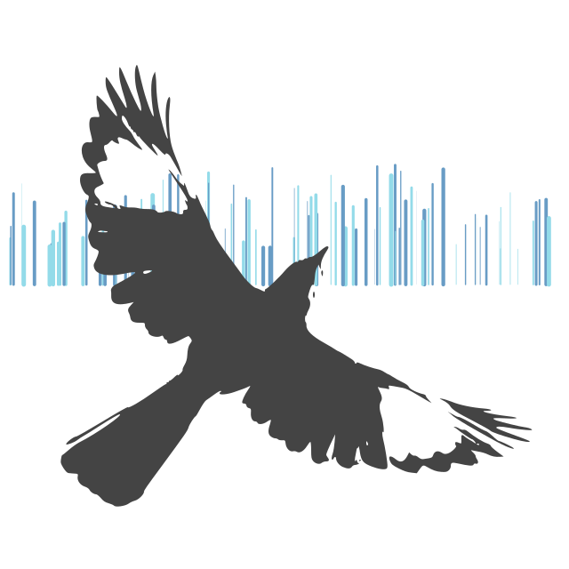

# Mockingbird - Interface

<p align="center">
    
</p>

<!-- [](https://github.com/digilab-ai/mockingbird-interface/actions/workflows/ci.yml) -->


[](https://digilabglobal.slack.com)

Python air traffic control simulator interface.

## Table of Contents

- [Mockingbird - Interface](#mockingbird---interface)
  - [Table of Contents](#table-of-contents)
  - [Requirements](#requirements)
  - [Quickstart](#quickstart)
  - [Testing](#testing)

## Requirements

-   [Python](https://www.python.org/downloads/)
-   [Poetry](https://python-poetry.org/docs/#installation)

## Quickstart

Change to the `interface` directory:

```bash
cd interface
```

Install the dependencies:

```bash
poetry install
```

## Testing

Run the tests:

```bash
poetry run pytest
```
